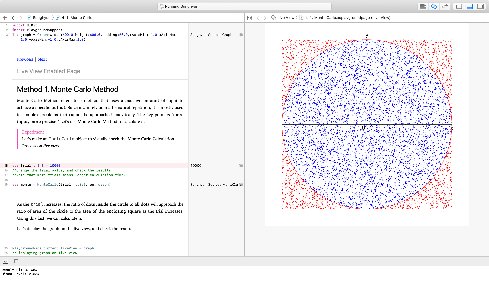
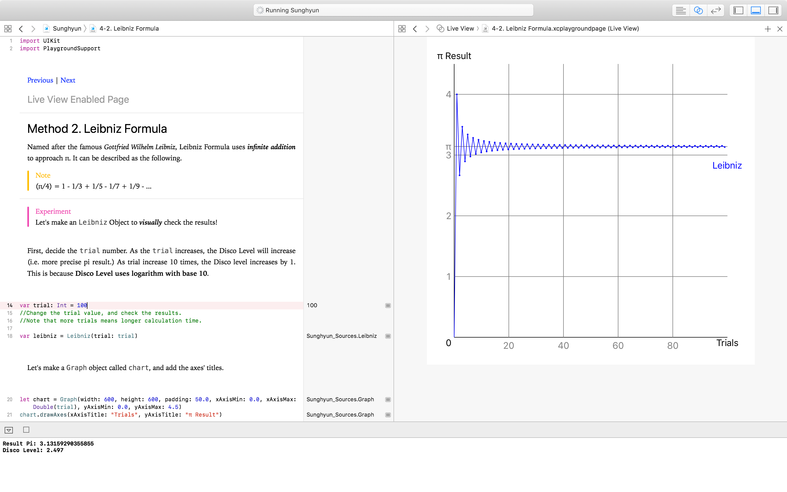
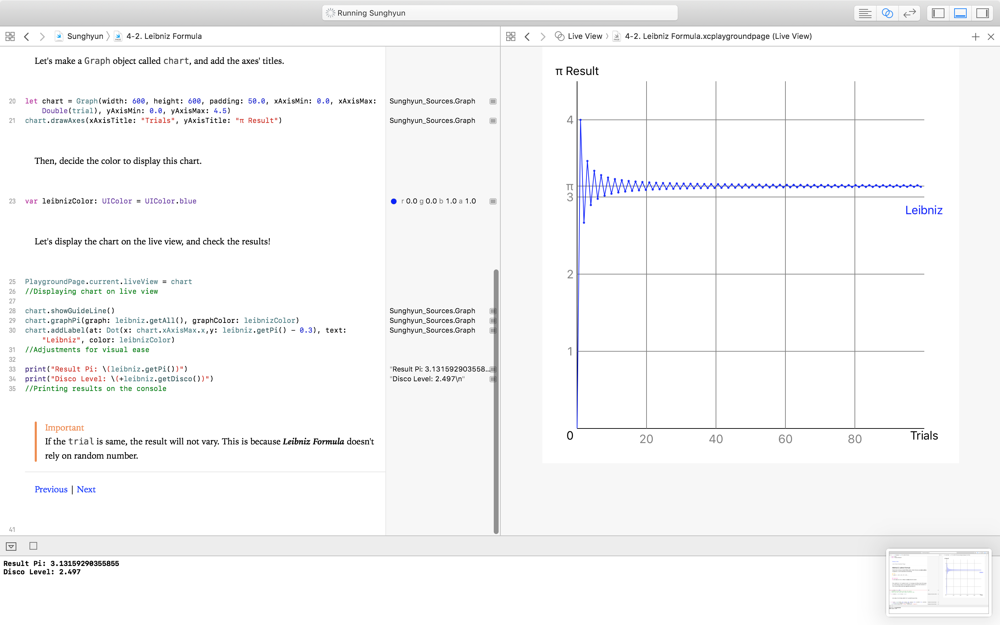
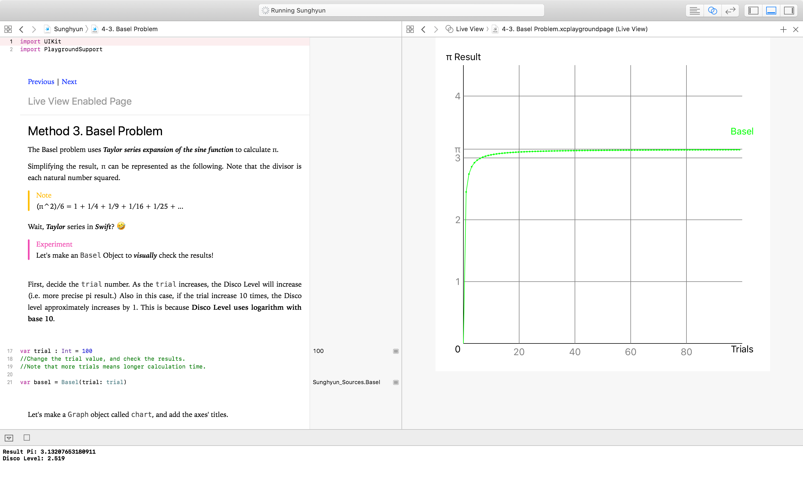
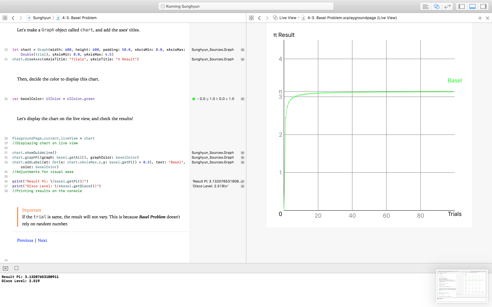
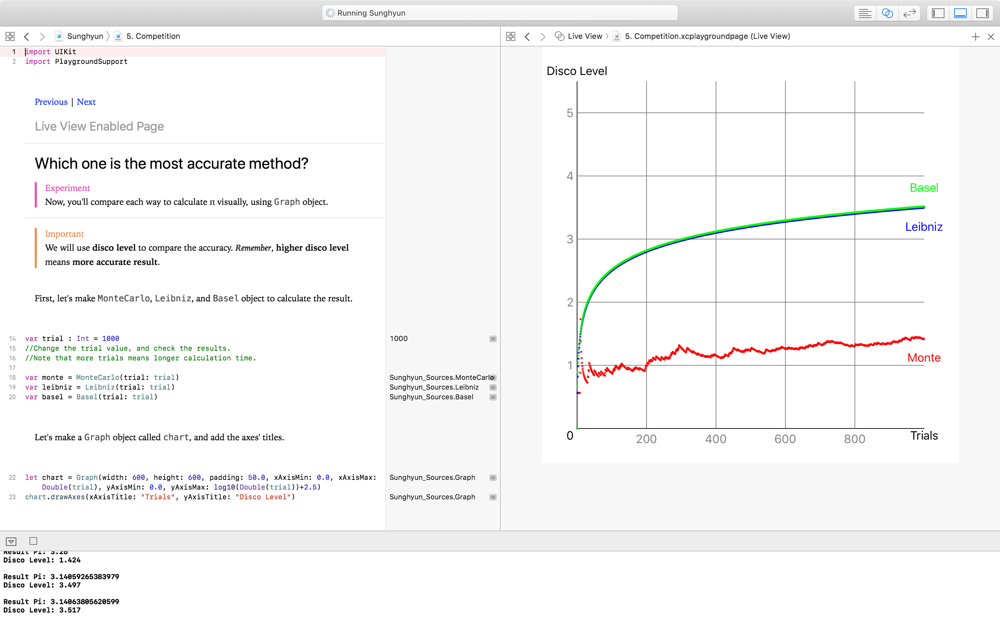
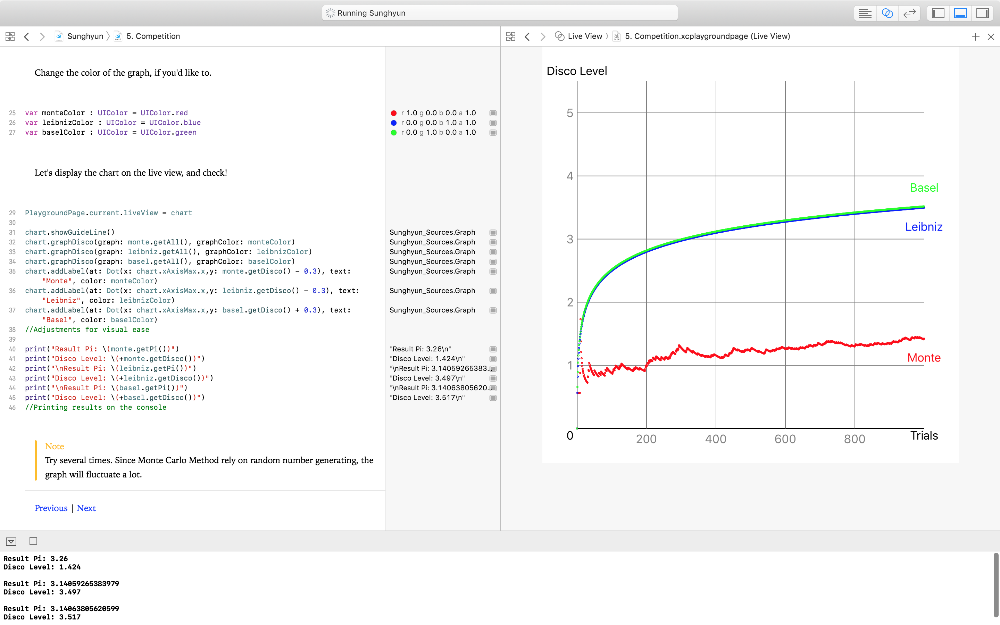
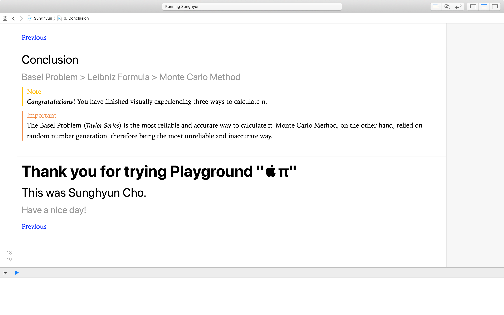

# Preview

## 1. Cover

## 2. Motivation

## 3. Disco Level

## 4-1. Monte Carlo Method

## 4-2. Leibniz Formula

## 4-3. Basel Problem

## 5. Competition

## 6. Conclusion

    Written by Sunghyun Cho on June 27th, 2018.